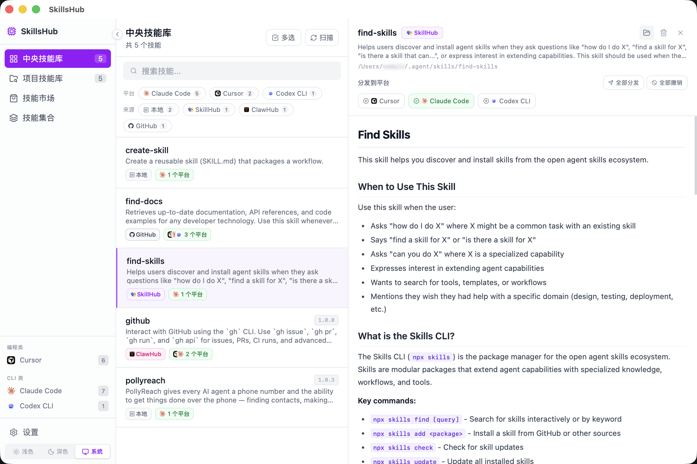

# SkillsHub

> 一站式 AI Agent Skills 管理桌面应用

SkillsHub 是一款跨平台桌面应用，帮助开发者统一管理分散在各 AI 编辑器和助手中的 Agent Skills（提示词、工具规则等配置文件），实现本地中央库存储、一键分发到各平台、收藏夹管理，以及从 Marketplace 在线获取社区 Skills。


---

## 功能特性

### 支持的 AI 平台

| AI 编辑器 | AI 助手 |
|-----------|---------|
| Cursor | Claude (Claude Code) |
| Trae / Trae CN | Codex CLI |
| Windsurf | Gemini CLI |
| Kiro | Qwen |
| Qoder | OpenCode |
| CodeBuddy | Hermes |

### 核心功能

- **中央库（Central Library）** — 统一存储所有 Skills，支持搜索、筛选、标签管理
- **项目库（Project Library）** — 按项目维度管理 Skills，支持扫描本地目录自动发现
- **一键分发** — 将 Skill 一键安装到指定 AI 平台的配置目录
- **收藏夹（Collections）** — 创建收藏分组，支持拖拽排序
- **Marketplace** — 从线上来源（GitHub、社区源等）浏览和安装 Skills
- **Markdown 预览** — 内置 Skill 内容预览，支持代码高亮
- **深色/浅色主题** — 自适应系统主题，支持手动切换
- **离线优先** — 本地 SQLite 存储，无需联网即可使用核心功能

---

## 截图

### 中央技能库 — 统一管理所有 Skills，支持平台筛选与 Markdown 预览



### 深色主题


### 技能市场 · SkillHub — 3 万+ 社区 Skills 一键安装


### 技能市场 · ClawHub


### 设置 · 平台管理 — 配置目标平台与安装路径


### 扫描本地 Skills — 自动发现并导入到中央库


---

## 安装

### 下载预构建包（推荐）

前往 [Releases](https://github.com/Necho-dev/skills-hub/releases) 页面下载对应平台的安装包：

| 平台 | 文件 |
|------|------|
| macOS (Apple Silicon) | `SkillsHub_x.x.x_aarch64.dmg` |
| Windows | `SkillsHub_x.x.x_x64-setup.exe` 或 `.msi` |
| Linux | `SkillsHub_x.x.x_amd64.AppImage` 或 `.deb` |

### macOS 首次打开说明

由于应用暂未进行 Apple 公证，首次打开时系统可能提示"无法验证开发者"。解决方式：

```bash
# 移除隔离属性后重新打开
xattr -cr /Applications/SkillsHub.app
```

### 在线更新

v0.1.1 起支持应用内在线更新。打开应用后进入 **设置 → 关于 → 版本更新**，点击「检查更新」即可查看并下载最新版本，无需手动重新安装。

---

## 本地开发

### 环境要求

- [Node.js](https://nodejs.org/) 20+
- [Rust](https://rustup.rs/) stable
- [Tauri CLI v2](https://tauri.app/start/prerequisites/)

**macOS 额外依赖：** Xcode Command Line Tools

```bash
xcode-select --install
```

**Linux 额外依赖：**

```bash
sudo apt-get install -y \
  libwebkit2gtk-4.1-dev libappindicator3-dev \
  librsvg2-dev patchelf libsoup-3.0-dev \
  libjavascriptcoregtk-4.1-dev
```

### 启动开发服务

```bash
# 克隆仓库
git clone https://github.com/Necho-dev/skills-hub.git
cd skills-hub

# 安装前端依赖
npm install

# 启动开发模式（热重载）
npm run tauri dev
```

### 构建生产包

```bash
npm run tauri build
```

构建产物位于 `src-tauri/target/release/bundle/`。

---

## 技术栈

| 层级 | 技术 |
|------|------|
| 桌面框架 | [Tauri v2](https://tauri.app/) |
| 前端框架 | [React 19](https://react.dev/) + [TypeScript](https://www.typescriptlang.org/) |
| 构建工具 | [Vite 7](https://vite.dev/) |
| 样式 | [Tailwind CSS v4](https://tailwindcss.com/) |
| 状态管理 | [Zustand](https://zustand-demo.pmnd.rs/) |
| 路由 | [React Router v7](https://reactrouter.com/) |
| 本地数据库 | SQLite（via [tauri-plugin-sql](https://github.com/tauri-apps/plugins-workspace)） |
| 拖拽排序 | [@dnd-kit](https://dndkit.com/) |
| Markdown | [react-markdown](https://github.com/remarkjs/react-markdown) + [highlight.js](https://highlightjs.org/) |
| 后端语言 | [Rust](https://www.rust-lang.org/) |

---

## 项目结构

```
skills-hub/
├── src/                        # 前端源码
│   ├── pages/                  # 页面组件
│   │   ├── CentralLibrary.tsx  # 中央库
│   │   ├── ProjectLibrary.tsx  # 项目库
│   │   ├── Collections.tsx     # 收藏夹
│   │   ├── Marketplace.tsx     # Marketplace
│   │   └── Settings.tsx        # 设置
│   ├── components/             # 通用组件
│   ├── stores/                 # Zustand 状态
│   ├── lib/                    # 工具函数
│   └── types/                  # TypeScript 类型
├── src-tauri/                  # Rust 后端
│   ├── src/
│   │   ├── commands/           # Tauri 命令处理
│   │   └── models.rs           # 数据模型
│   ├── migrations/             # SQLite 数据库迁移
│   └── tauri.conf.json         # Tauri 配置
├── public/
│   └── platform-icons/         # 平台图标资源
└── .github/workflows/          # CI/CD 配置
```

---

## CI / CD

本项目使用 GitHub Actions 实现自动化：

- **`ci.yml`** — 每次向 `main` 分支 push 或 PR 时，自动执行 TypeScript 类型检查和前端构建
- **`release.yml`** — 推送版本 tag（如 `v1.0.0`）时，自动并行构建三个平台（macOS Apple Silicon、Windows、Linux）的安装包并发布到 GitHub Releases

### 发布新版本

```bash
git tag v1.0.0
git push origin v1.0.0
```

---

## 贡献指南

欢迎提交 Issue 和 Pull Request！

1. Fork 本仓库
2. 创建特性分支：`git checkout -b feat/your-feature`
3. 提交改动：`git commit -m 'feat: add some feature'`
4. 推送分支：`git push origin feat/your-feature`
5. 提交 Pull Request

提交信息请遵循 [Conventional Commits](https://www.conventionalcommits.org/) 规范。

---

## License

[MIT](./LICENSE)
